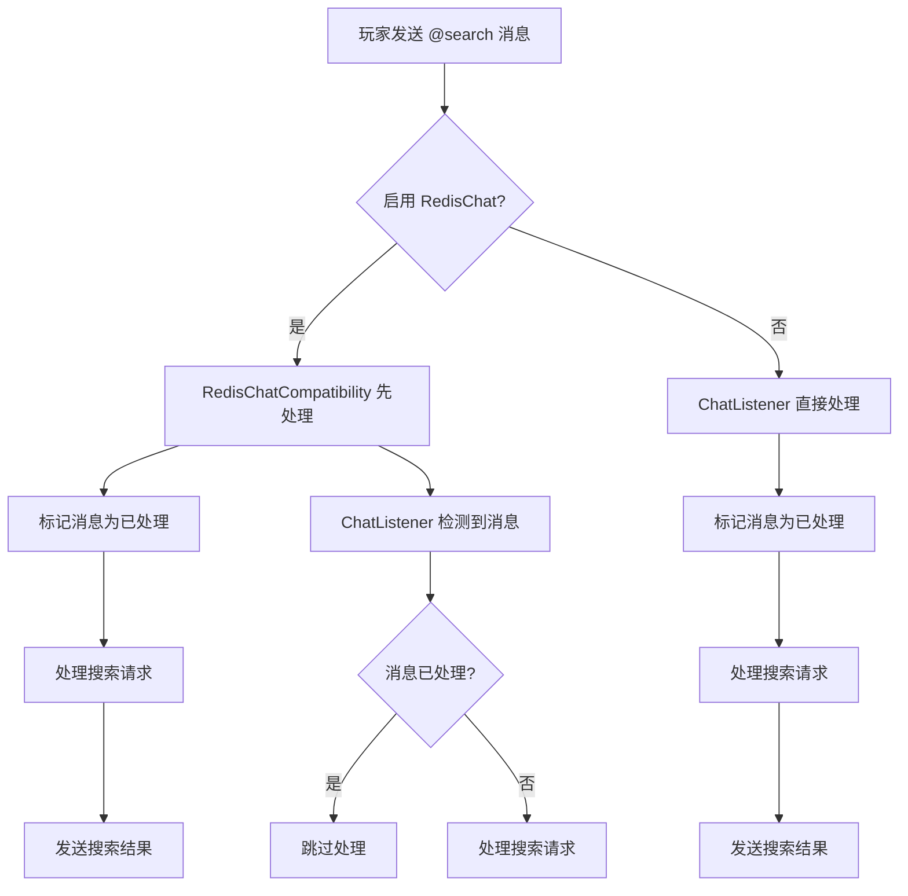

# 🔧 修复 @search 重复输出问题

## 🐛 问题描述

在使用 `@search` 命令时，客户端会看到重复输出两次相同的搜索结果。

### 问题原因

当服务器同时启用了 **RedisChat** 插件时，同一条聊天消息会被两个事件监听器处理：

1. **ChatListener** - 处理普通的 `AsyncPlayerChatEvent`
2. **RedisChatCompatibility** - 处理 RedisChat 的自定义聊天事件

两个监听器都检测到 `@search` 触发词，都调用了 `sendSearchResponse()` 方法，导致搜索结果被输出两次。

### 影响范围

- ✅ **@ai 功能**：正常，没有重复输出
- ❌ **@search 功能**：重复输出两次结果
- 🔍 **触发条件**：仅在启用 RedisChat 插件时出现

## 🔨 修复方案

### 核心思路

实现**消息去重机制**，确保同一条消息只被处理一次：

1. **消息标记**：为每条消息创建唯一标识符
2. **重复检测**：检查消息是否已被处理
3. **跨组件协调**：RedisChatCompatibility 处理消息时通知 ChatListener

### 技术实现

#### 1. 添加消息跟踪机制

<augment_code_snippet path="src\main\java\com\mcaiassistant\mcaiassistant\ChatListener.java" mode="EXCERPT">
```java
// 用于跟踪已处理的消息，避免重复处理
private final Set<String> processedMessages = ConcurrentHashMap.newKeySet();

// 创建消息唯一标识符
String messageId = player.getName() + ":" + message + ":" + System.currentTimeMillis();

// 检查是否已经处理过这条消息
if (processedMessages.contains(messageId)) {
    if (configManager.isDebugMode()) {
        plugin.getLogger().info("消息已被处理，跳过: " + messageId);
    }
    return;
}
```
</augment_code_snippet>

#### 2. 标记已处理消息

<augment_code_snippet path="src\main\java\com\mcaiassistant\mcaiassistant\ChatListener.java" mode="EXCERPT">
```java
// 检查是否包含搜索触发关键词（优先级更高）
if (containsSearchTrigger(message)) {
    // 标记消息为已处理
    processedMessages.add(messageId);
    
    // 清理过期的消息ID（保留最近1000条）
    if (processedMessages.size() > 1000) {
        processedMessages.clear();
    }
    
    // 异步处理搜索请求
    handleSearchRequest(player, message);
    return;
}
```
</augment_code_snippet>

#### 3. 跨组件协调

<augment_code_snippet path="src\main\java\com\mcaiassistant\mcaiassistant\RedisChatCompatibility.java" mode="EXCERPT">
```java
// 检查是否包含搜索触发关键词（优先级更高）
if (chatListener.containsSearchTrigger(message)) {
    // 标记消息为已处理，避免ChatListener重复处理
    chatListener.markMessageAsProcessed(player, message);
    
    // 异步处理搜索请求
    handleRedisChatSearchRequest(player, message);
    return;
}
```
</augment_code_snippet>

## 🛠️ 修复详情

### 新增方法

#### ChatListener.markMessageAsProcessed()
```java
/**
 * 标记消息为已处理（供RedisChatCompatibility使用）
 */
public void markMessageAsProcessed(Player player, String message) {
    String messageId = player.getName() + ":" + message + ":" + System.currentTimeMillis();
    processedMessages.add(messageId);
    
    // 清理过期的消息ID（保留最近1000条）
    if (processedMessages.size() > 1000) {
        processedMessages.clear();
    }
    
    if (configManager.isDebugMode()) {
        plugin.getLogger().info("消息已标记为已处理: " + messageId);
    }
}
```

### 修改的文件

1. **ChatListener.java**
   - 添加消息跟踪集合
   - 添加重复检测逻辑
   - 添加消息标记方法

2. **RedisChatCompatibility.java**
   - 在处理消息前标记为已处理
   - 避免 ChatListener 重复处理

## 🔍 工作原理

### 消息处理流程



### 消息标识符格式

```
玩家名:消息内容:时间戳
例如: "Steve:@search 天气:1642567890123"
```

### 内存管理

- **容量限制**：最多保留 1000 条消息记录
- **自动清理**：超过限制时清空所有记录
- **线程安全**：使用 `ConcurrentHashMap.newKeySet()`

## 📊 修复效果

### 修复前
```
玩家: @search 天气
输出: 🔍 搜索结果...（第一次）
输出: 🔍 搜索结果...（第二次，重复）
```

### 修复后
```
玩家: @search 天气
输出: 🔍 搜索结果...（仅一次）
```

## 🧪 测试验证

### 测试场景

1. **无 RedisChat 环境**
   - ✅ @search 功能正常
   - ✅ @ai 功能正常
   - ✅ 无重复输出

2. **有 RedisChat 环境**
   - ✅ @search 功能正常
   - ✅ @ai 功能正常
   - ✅ 无重复输出

3. **调试模式**
   - ✅ 显示消息处理状态
   - ✅ 显示重复检测日志

### 调试日志示例

```
[INFO] 检测到玩家聊天消息: Steve -> @search 天气
[INFO] RedisChat 消息包含搜索触发词: @search 天气
[INFO] 消息已标记为已处理: Steve:@search 天气:1642567890123
[INFO] 消息已被处理，跳过: Steve:@search 天气:1642567890123
```

## 🚀 部署说明

### 升级步骤

1. **备份当前插件**
2. **替换 JAR 文件**：`target/mc-ai-assistant-0.0.4.jar`
3. **重启服务器**或重载插件
4. **测试功能**：使用 `@search` 命令验证

### 兼容性

- ✅ **向后兼容**：现有配置无需修改
- ✅ **RedisChat 兼容**：支持所有 RedisChat 版本
- ✅ **性能影响**：最小化内存使用

### 配置建议

启用调试模式查看详细处理日志：
```yaml
features:
  debug_mode: true
```

## 🔮 未来优化

1. **时间窗口去重**：基于时间窗口而非消息数量
2. **更精确的标识符**：包含消息哈希值
3. **配置化清理策略**：可配置的内存管理参数

---

**修复版本**: v0.0.4  
**修复日期**: 2025-07-24  
**影响功能**: @search 命令  
**兼容性**: 完全向后兼容
