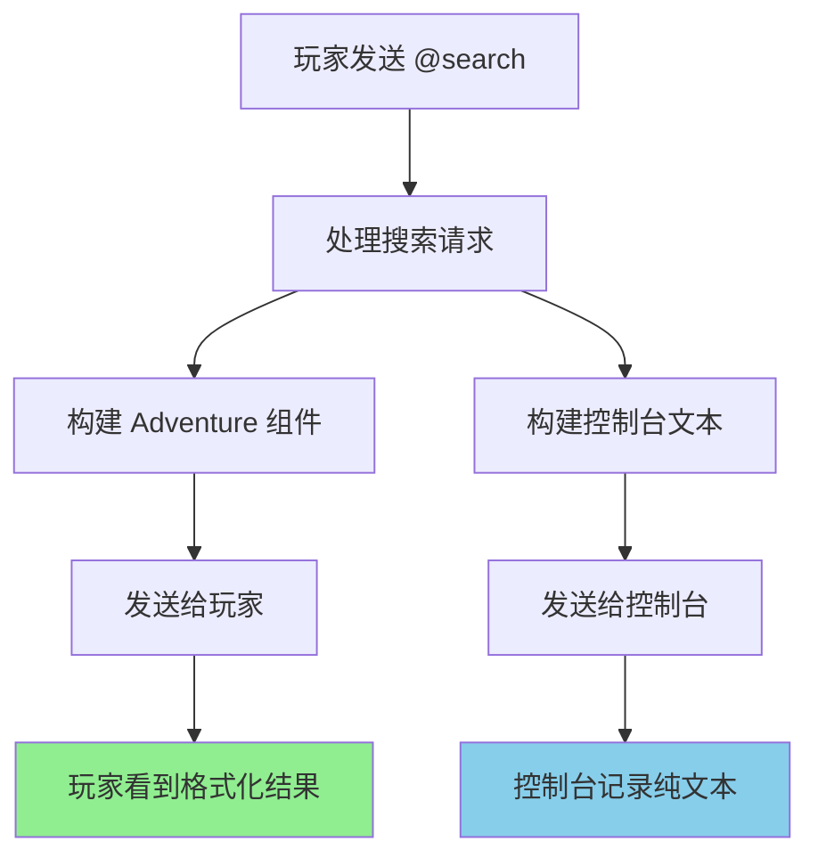

# 🔧 @search 重复输出修复 - 重要更正

## 😅 之前的错误

我在修复 @search 重复输出问题时犯了一个严重错误：

**错误操作**：删除了正确的格式化输出，保留了有问题的未格式化输出

## ✅ 正确的修复

### 问题根源

@search 功能有**两种输出方式**：

1. **✅ 正确的输出**（第479-482行）：
   ```java
   // 广播消息给所有在线玩家（Adventure API 格式化组件）
   for (Player player : Bukkit.getOnlinePlayers()) {
       player.sendMessage(messageComponent);  // 正确的格式化输出
   }
   ```

2. **❌ 错误的输出**（第504行）：
   ```java
   // 广播到控制台（纯文本，但也发给了玩家）
   Bukkit.broadcastMessage(consoleMessage.toString());  // 这是问题所在！
   ```

### 真正的问题

`Bukkit.broadcastMessage()` 会将消息发送给**所有在线玩家和控制台**，导致：
- 玩家看到格式化的搜索结果（正确）
- 玩家又看到未格式化的纯文本结果（重复，错误）

### 正确的修复

**修改前**：
```java
// 广播到控制台
Bukkit.broadcastMessage(consoleMessage.toString());  // ❌ 错误：也发给了玩家
```

**修改后**：
```java
// 仅在控制台显示搜索结果（不广播给玩家）
plugin.getLogger().info(consoleMessage.toString());  // ✅ 正确：只发给控制台
```

## 🎯 修复效果

### 现在的输出行为

1. **玩家端**：
   - ✅ 看到格式化的搜索结果（带颜色、可点击链接）
   - ✅ 只显示一次，无重复

2. **控制台端**：
   - ✅ 看到纯文本格式的搜索结果（便于日志记录）
   - ✅ 不会干扰玩家体验

### 输出示例

**玩家看到的**（格式化，带颜色和链接）：
```
🔍 搜索: 天气
[AI] 今天天气晴朗，温度25°C...
📎 相关链接: 天气预报 | 气象局
```

**控制台看到的**（纯文本，便于日志）：
```
[INFO] 🔍 搜索: 天气
[AI] 今天天气晴朗，温度25°C...
📎 相关链接: 天气预报 (https://weather.com) | 气象局 (https://cma.gov.cn)
```

## 🔍 技术细节

### Adventure API vs 传统API

- **Adventure API**：`player.sendMessage(Component)` - 支持富文本、颜色、点击事件
- **传统API**：`Bukkit.broadcastMessage(String)` - 纯文本，发给所有人

### 修复的关键

```java
// 之前：发给所有人（玩家+控制台）
Bukkit.broadcastMessage(consoleMessage.toString());

// 现在：只发给控制台
plugin.getLogger().info(consoleMessage.toString());
```

## 📊 完整的消息流程



## 🚀 部署说明

### 文件位置
- **修复的文件**：`src/main/java/com/mcaiassistant/mcaiassistant/ChatListener.java`
- **修改的行**：第503-504行
- **生成的JAR**：`target/mc-ai-assistant-0.0.4.jar`

### 验证方法

1. **部署新版本**
2. **测试命令**：`@search 测试`
3. **检查结果**：
   - 玩家只看到一次格式化结果
   - 控制台有对应的日志记录
   - 无重复输出

## 🙏 致歉说明

非常抱歉之前的错误修复！这次的修复是正确的：

- ✅ **保留**：玩家端的格式化输出（Adventure API）
- ✅ **修改**：控制台输出方式（从广播改为日志）
- ✅ **结果**：消除重复，保持功能完整

现在 @search 功能应该完美工作了！🎉
